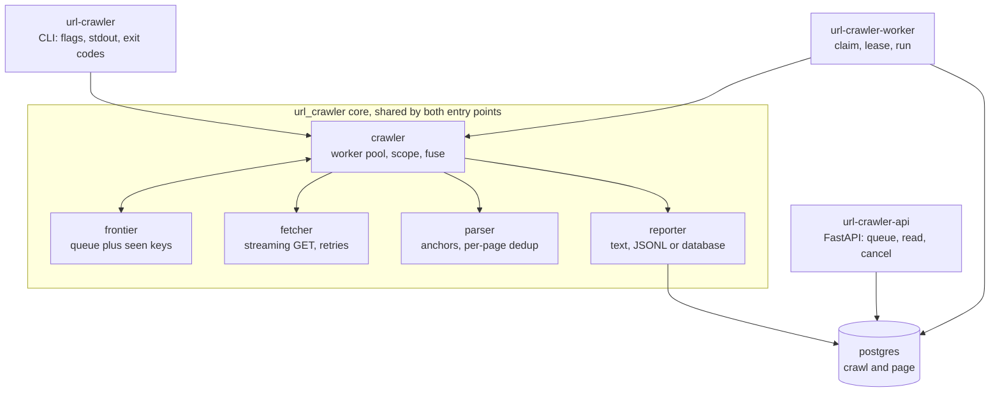

# url-crawler

A Python CLI that takes one URL, crawls the whole site behind it, and prints every page it visits
together with every link found on that page. It stays on a single host: no other domains, no
subdomains.

Two entry points sit over one crawl core, and they are independent:

- **[The CLI](#the-cli)** streams results to stdout as each page completes, so a large crawl is
  useful before it finishes. Read that one section and you have the whole tool.
- **[The crawl service](#the-crawl-service)** runs the same crawl as a background job behind an HTTP
  API. Entirely skippable for a CLI-only review: a separate pip extra, separate docs, and nothing in
  the CLI path imports it.

## How the brief was read

<details>
<summary>Four readings were ambiguous, so the choices are stated up front</summary>

- **Scope restricts what is followed, not what is printed.** A link to another domain or to a
  subdomain appears in the output of the page that contained it, and is never requested.
- **"URLs found on a page" means anchor hyperlinks**, `a[href]` and `area[href]`, not subresources
  such as `img`, `script` or `link`. Anchors are the navigable graph the crawl walks.
- **Only http(s) anchors are output.** A `mailto:`, `tel:`, `javascript:` or `data:` href is dropped
  by normalization, so it is neither printed nor followed. The brief says every URL found on the
  page; these are not URLs a crawler can visit.
- **Per-page output is deduplicated in first-occurrence document order.** A navigation menu repeated
  in a header and a footer prints once. Links are not sorted, because document order is already
  deterministic.

Redirects follow from the same model: the HTTP client never follows one, and a 301/302/303/307/308
response is reported as a page whose single link is its `Location`. The
[design decisions](docs/design-decisions.md) cover what that model buys.

</details>

## Architecture

<details>
<summary>One core, two entry points, and Postgres only on the service side</summary>



[docs/architecture.md](docs/architecture.md) has the module tables, the worker loop, the data model
and the claim, heartbeat and reaper design.

</details>

## The CLI

<details>
<summary>Install, crawl, output, flags and exit codes</summary>

Requires Python 3.12+ and [uv](https://docs.astral.sh/uv/). Full reference in
[docs/cli.md](docs/cli.md).

```bash
uv sync                                                     # install, from the committed uv.lock
uv run url-crawler https://example.com                      # crawl and print to stdout
uv run url-crawler example.com --format jsonl > out.jsonl   # scheme defaults to https
docker build --target cli -t url-crawler . && docker run --rm url-crawler https://example.com
```

Without uv, `pip install .` gets the CLI and `pip install '.[service]'` adds the crawl service.

Each page prints on its own line with its links indented under it, against the bundled fake site
(`uv run python -m tests.fakesite.server --port 8765`):

```
$ uv run url-crawler http://127.0.0.1:8765/ --max-pages 4 --concurrency 2
http://127.0.0.1:8765/
  http://127.0.0.1:8765/a
  ...
  http://external.test/x
  http://sub.site.test/x

http://127.0.0.1:8765/b
  http://127.0.0.1:8765/a
```

Those two off-host links print and are never requested. Logs and the closing summary go to stderr,
so a pipe carries results only, and `--format jsonl` swaps the text reporter for one object per page
plus a final summary object.

Flags worth knowing: `--concurrency`, `--timeout`, `--max-pages`, `--max-bytes`, `--request-budget`,
`--ignore-robots`, `--user-agent` and `-v`. The [flag table](docs/cli.md#flags) and the
[exit codes](docs/cli.md#exit-codes) are both in docs/cli.md.

</details>

## The crawl service

Optional, and skippable for a CLI review. Full reference in [docs/service.md](docs/service.md).

<details>
<summary>Run it, and where the interactive API documentation lives</summary>

```bash
docker compose up --build -d   # postgres, alembic upgrade, api on :8000, one worker
curl -sS localhost:8000/healthz   # {"status":"ok"}
```

FastAPI serves its own documentation with no flag to enable it: Swagger UI at **`/docs`**, ReDoc at
**`/redoc`**, the OpenAPI schema at **`/openapi.json`**. All three answer 200 once the API is up.
Scale with `docker compose up -d --scale worker=3`; nothing coordinates the workers, each claims its
own crawl. `docker compose down` stops the stack.

</details>

Every response below is real, trimmed where marked. They come from a crawl of the bundled fake site
with the seed guard relaxed the way `tests/service/test_end_to_end.py` relaxes it, which is why the
seeds read `http://127.0.0.1:8765/`. A deployed service refuses a seed on a private address, so
point yours at a public URL.

<details>
<summary><code>POST /crawls</code> — queue a crawl, 202 with a <code>Location</code> header</summary>

```bash
curl -sS -D- -X POST localhost:8000/crawls -H 'content-type: application/json' \
  -d '{"seed": "https://example.com", "max_pages": 5}'
```

```
HTTP/1.1 202 Accepted
location: /crawls/5742636b-aad2-48ae-b13f-09b2b7306f95
```

```json
{"id": "5742636b-aad2-48ae-b13f-09b2b7306f95", "seed": "http://127.0.0.1:8765/",
 "state": "queued", "created_at": "2026-09-09T13:59:27.893104Z",
 "config": {"timeout": 10.0, "max_bytes": 5000000, "max_pages": 5,
            "concurrency": 10, "respect_robots": true},
 "started_at": null, "finished_at": null, "attempts": 0,
 "cancel_requested": false, "stats": null, "error": null}
```

The seed takes the same normalization the CLI uses, so `"example.com"` is stored as
`https://example.com/`. A seed that is private, unresolvable or not http(s) is a 422 with
`{"detail": {"seed": "localhost is a local hostname"}}`; a bad field is a 422 from pydantic.

</details>

<details>
<summary><code>GET /crawls</code> — newest first, 200</summary>

```bash
curl -sS 'localhost:8000/crawls?limit=2&state=finished'
```

```json
{"items": [
  {"id": "5742636b-aad2-48ae-b13f-09b2b7306f95", "seed": "http://127.0.0.1:8765/",
   "state": "finished", "attempts": 1, "cancel_requested": false, "error": null,
   "started_at": "2026-09-09T13:59:27.907010Z", "finished_at": "2026-09-09T13:59:28.074764Z",
   "stats": {"pages_total": 5, "pages_ok": 4, "links_found": 21, "…": "full shape below"},
   "config": {"…": "as posted"}, "created_at": "2026-09-09T13:59:27.893104Z"}
]}
```

`state` filters, `limit` is 1 to 200 and defaults to 50.

</details>

<details>
<summary><code>GET /crawls/{id}</code> — one crawl and its stats, 200 or 404</summary>

```bash
curl -sS localhost:8000/crawls/5742636b-aad2-48ae-b13f-09b2b7306f95
```

```json
{"id": "5742636b-aad2-48ae-b13f-09b2b7306f95", "state": "finished", "attempts": 1,
 "stats": {"retries": 0, "pages_ok": 4, "redirects": 0, "links_found": 21,
           "pages_total": 5, "pages_failed": {"http_status": 1}, "elapsed_seconds": 0.119,
           "duplicates_dropped": 5, "pages_without_links": 0},
 "…": "seed, config, the three timestamps, cancel_requested and error, as above"}
```

This is what says whether a crawl finished. An unknown id is 404 `{"detail": "crawl not found"}`.

</details>

<details>
<summary><code>GET /crawls/{id}/pages</code> — keyset page list, 200</summary>

```bash
curl -sS 'localhost:8000/crawls/5742636b-aad2-48ae-b13f-09b2b7306f95/pages?after=3&limit=2'
```

```json
{"items": [
  {"seq": 4, "url": "http://127.0.0.1:8765/missing", "status": 404, "links": [],
   "error": {"kind": "http_status", "message": "HTTP 404"},
   "fetched_at": "2026-09-09T13:59:28.025666Z"},
  {"seq": 5, "url": "http://127.0.0.1:8765/a", "status": 200, "error": null,
   "links": ["http://127.0.0.1:8765/b", "http://127.0.0.1:8765/"],
   "fetched_at": "2026-09-09T13:59:28.061536Z"}
], "next_after": 5}
```

`after` is the last `seq` you saw, `limit` is 1 to 500 and defaults to 100. `next_after` is null
when you have read everything written so far, which is not the same as the crawl being over.

</details>

<details>
<summary><code>GET /crawls/{id}/events</code> — server-sent progress, 200</summary>

```bash
curl -sSN localhost:8000/crawls/5742636b-aad2-48ae-b13f-09b2b7306f95/events
```

```
event: stats
data: {"id":"5742636b-aad2-48ae-b13f-09b2b7306f95","state":"finished","attempts":1, …}

event: end
data: {}
```

`content-type: text/event-stream`. One `stats` frame every two seconds carrying the same body as
`GET /crawls/{id}`, then one `end` frame when the crawl reaches a terminal state. 404 for an unknown
id.

</details>

<details>
<summary><code>DELETE /crawls/{id}</code> — request cancellation, 202</summary>

```bash
curl -sS -X DELETE localhost:8000/crawls/78afa4eb-7452-426f-8f87-25a2d5667df1
```

```json
{"id": "78afa4eb-7452-426f-8f87-25a2d5667df1", "state": "aborted"}
```

A request, not a kill. A `queued` crawl is aborted outright, a `running` one is flagged and stops at
its worker's next heartbeat with its partial pages kept, and a terminal one comes back unchanged
(`"state": "finished"`). 404 for an unknown id.

</details>

<details>
<summary><code>GET /healthz</code> — 200, or 503 when the database is unreachable</summary>

```bash
curl -sS localhost:8000/healthz
```

```json
{"status": "ok"}
```

200 after a `SELECT 1`; 503 with `{"detail": "database unavailable"}` when Postgres is unreachable.

</details>

## Noteworthy

- **Speed.** 20 workers crawl 301 pages in 1.93s, 156 pages/s, against a fake site with a 50ms
  per-request delay. The patterns behind that number, the method and the caveats are in
  [docs/performance.md](docs/performance.md).
- **Safety.** robots.txt is on by default, matched per RFC 9309 section 2.2 rather than by the
  standard library's prefix rules, and one that cannot be read blocks the crawl. Scope is exact
  `(host, port)` equality, credentials in a URL are stripped before it is queued or printed, a URL
  carrying a control byte is refused so a crawled page cannot write escape sequences into your
  terminal, and bodies stream behind a content-type gate and a size cap that bounds memory even for
  a gzip bomb. The service also refuses a seed, a seed redirect or a robots.txt redirect that
  resolves to a private address; the CLI does not, because your own terminal already reaches those.
- **Exit codes that mean something.** 0 finished, 2 usage error, 3 unusable seed, 4 failure fuse
  tripped, 130 interrupted with partial output flushed ([table](docs/cli.md#exit-codes)).
- **Two runtime dependencies.** The CLI needs `httpx` and `selectolax` and nothing else; the service
  adds `fastapi`, `sqlalchemy`, `asyncpg`, `alembic` and `uvicorn` behind the optional `service`
  extra. The frontier, the scope check, the retry policy, the robots.txt handling and the link
  extraction are written here rather than pulled from a crawling framework, which is what makes each
  of them testable and explainable in the docs below.
- **663 tests**, deterministic and offline by default, over a fake site that packs every crawl
  hazard into 20 pages. 82% coverage offline, 97% with a Postgres
  ([docs/testing.md](docs/testing.md)).

Everything runs through `make`, and CI runs the same targets:

```bash
make check     # ruff check, ruff format --check, mypy --strict, then the test suite
make test      # 663 tests, offline and deterministic
make db-up     # local Postgres for the service and its tests
make bench     # the concurrency sweep behind the speed number above
```

## Design decisions

<details>
<summary>Fifteen calls, each naming the option rejected and what would reverse it</summary>

| Decision | Why (one line) |
| --- | --- |
| [asyncio, one client, N workers](docs/design-decisions.md#asyncio-with-one-client-and-n-workers) | A crawl waits on sockets, so tasks beat threads and processes. |
| [The worker count is the only limit](docs/design-decisions.md#the-worker-count-is-the-only-limit) | No second semaphore, no rps cap, and an unbounded queue on purpose. |
| [Redirects are never followed by the client](docs/design-decisions.md#redirects-are-never-followed-by-the-client) | The client must never be the thing that picks the next host. |
| [Exact-host scope, re-anchored after a seed redirect](docs/design-decisions.md#exact-host-scope-re-anchored-after-a-seed-redirect) | Equality, not suffix matching, and apex to www still works. |
| [One normal form, and a stricter key for dedup](docs/design-decisions.md#one-normal-form-and-a-stricter-key-for-dedup) | The URL printed is the site's; the key that dedups it is not. |
| [Robots on by default, and unreadable means blocked](docs/design-decisions.md#robots-on-by-default-and-unreadable-means-blocked) | robots.txt is the access control, and a 5xx on it is not a yes. |
| [Retry classification by leaf type](docs/design-decisions.md#retry-classification-by-leaf-type) | Enumerate the retryable exceptions, never their base class. |
| [No circuit breaker, but a failure fuse](docs/design-decisions.md#no-circuit-breaker-but-a-failure-fuse) | One bounded batch against one host has nothing to half-open. |
| [A page with no links is a leaf](docs/design-decisions.md#a-page-with-no-links-is-a-leaf) | And 90% of them is the answer to the JavaScript sites this tool cannot render. |
| [Postgres in the service, and no Celery or Redis](docs/design-decisions.md#postgres-in-the-service-and-no-celery-or-redis) | The job store is a table, not a broker, and the CLI needs no store at all. |
| [An HTTP API, no UI](docs/design-decisions.md#an-http-api-no-ui) | Keyset pagination is the interesting part, and a UI would only wrap it. |
| [The service guards its seed host, the CLI does not](docs/design-decisions.md#the-service-guards-its-seed-host-the-cli-does-not) | An API borrows its worker's network; a terminal borrows nothing. |
| [Standard library logging and a stats dataclass](docs/design-decisions.md#standard-library-logging-and-a-stats-dataclass) | stdout stays clean, and the counters outlive a cancelled task. |
| [One generic parser, no Strategy or Factory](docs/design-decisions.md#one-generic-parser-no-strategy-or-factory) | The seed is arbitrary, so there is no dispatch key at design time. |
| [Playwright and Scrapy](docs/design-decisions.md#playwright-and-scrapy) | Both banned by the exercise, and named because a reviewer will wonder. |

</details>

## Tooling and AI disclosure

Visual Studio Code was the editor and nothing more: no Copilot, no inline completion. Every AI
interaction ran through Claude Code in a multi-agent workflow I directed, where architect agents
proposed candidate architectures, critics attacked them, and writer agents implemented one module
each against an interface contract I approved before any code was written. Nothing here rests on a
model having said it: behaviour is pinned by the test suite, types by `mypy --strict`, style by
`ruff`, dependency versions by the committed `uv.lock`, and the speed table by a benchmark measured
on the machine it names. [docs/ai-disclosure.md](docs/ai-disclosure.md) has the full account,
including two mistakes the review loop caught.

## Documentation

| Page | What is in it |
| --- | --- |
| [docs/architecture.md](docs/architecture.md) | Features, core modules, the worker loop, the service, the data model, claim and lease |
| [docs/design-decisions.md](docs/design-decisions.md) | Every decision in full, with the rejected option and the reversal trigger |
| [docs/cli.md](docs/cli.md) | Flags, exit codes, text and JSONL output, the banner and the progress line |
| [docs/service.md](docs/service.md) | Crawl service: running it, the API, configuration, what it does not do yet |
| [docs/performance.md](docs/performance.md) | Patterns used for speed, the benchmark and its method, the caveats |
| [docs/testing.md](docs/testing.md) | Test layers, how to run each, the fake site, CI, lint and types |
| [docs/extending.md](docs/extending.md) | Multi-domain crawling, why a CLI stops fitting, ranked future work |
| [docs/ai-disclosure.md](docs/ai-disclosure.md) | Tooling, sources consulted, what AI drafted, how it was verified |

## License

MIT. See [LICENSE](LICENSE).
