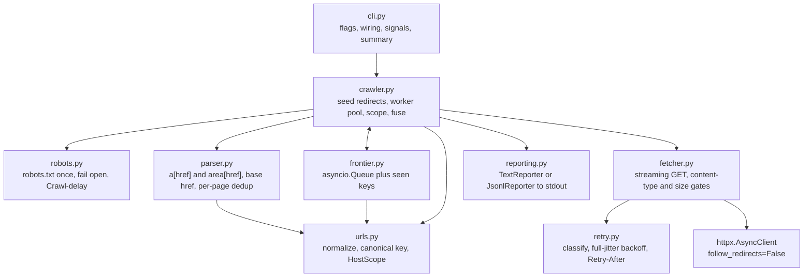

# url-crawler

A Python CLI that takes one URL, crawls the whole site behind it, and prints every page it visits
together with every link found on that page. It stays on a single host: no other domains, no
subdomains. Output streams to stdout as each page completes, so a large crawl is useful before it
finishes.

Three readings of the brief were ambiguous, so the choices are stated up front:

- **Scope restricts what is followed, not what is printed.** A link to another domain or to a
  subdomain appears in the output of the page that contained it, and is never requested.
- **"URLs found on a page" means anchor hyperlinks**, `a[href]` and `area[href]`, not subresources
  such as `img`, `script` or `link`. Anchors are the navigable graph the crawl walks.
- **Per-page output is deduplicated in first-occurrence document order.** A navigation menu repeated
  in a header and a footer prints once. Links are not sorted, because document order is already
  deterministic.

Redirects follow from the same model: `follow_redirects=False`, and a 301/302/303/307/308 response
is reported as a page whose single link is its `Location`.
[Design decisions](#design-decisions) covers what that model buys.

## Features

- Recursive crawl of one host with cycle-safe deduplication and a definite end.
- Bounded concurrency: N asyncio workers over one shared `httpx.AsyncClient` connection pool.
- URL normalization, and dedup by a canonical key that ignores query parameter order.
- Exact case-insensitive `(host, port)` scope. `www.example.com` is not `example.com`.
- Redirects modelled as links, so once the seed's chain settles, nothing off-host is contacted.
- robots.txt on by default, `Crawl-delay` honoured, fail open when robots.txt cannot be read.
- Retries with full jitter for retryable statuses and transport errors, `Retry-After` respected.
- Bodies streamed behind a content-type gate and a size cap, so a 4 GB video is never downloaded.
- Text or JSONL output. Results on stdout, logs and the run summary on stderr.
- Exit codes that mean something, partial output flushed on Ctrl-C, and `| head` handled cleanly.
- A failure fuse that aborts a crawl which has stopped producing anything but errors.

## Quickstart

Requires Python 3.12+ and [uv](https://docs.astral.sh/uv/).

```bash
uv sync                                             # install, from the committed uv.lock
uv run url-crawler https://example.com              # crawl and print to stdout
uv run url-crawler example.com --format jsonl > out.jsonl   # scheme defaults to https
uv run url-crawler https://example.com -v --max-pages 200   # progress logs and a page cap
```

With Docker:

```bash
docker build -t url-crawler .
docker run --rm url-crawler https://example.com
```

Without uv, in any virtual environment:

```bash
pip install .
url-crawler https://example.com
```

`python -m url_crawler <url>` works the same as the `url-crawler` script.

## Sample output

Trimmed from a real run against the fake site the test suite uses, which packs every hazard into 20
pages. The site answers on a loopback port but writes its absolute links against its nominal host
`site.test`, so `http://sub.site.test/x` is the subdomain case below and `http://external.test/x`
the foreign-domain one. Page URLs sit at column zero, their links are indented two spaces, and a
blank line closes each page.

```
$ uv run url-crawler http://127.0.0.1:39735 --concurrency 1
http://127.0.0.1:39735/
  http://127.0.0.1:39735/a
  http://127.0.0.1:39735/leaf
  http://127.0.0.1:39735/robots-blocked
  http://external.test/x
  http://sub.site.test/x

http://127.0.0.1:39735/missing  [error: http_status 404]

http://127.0.0.1:39735/redirect  [redirect 301]
  http://127.0.0.1:39735/redirected

http://127.0.0.1:39735/off-site-redirect  [redirect 302]
  http://external.test/landing

http://127.0.0.1:39735/file.pdf  [error: unsupported_content 200]

http://127.0.0.1:39735/leaf

```

Six pages of the twenty are shown, and the seed's link list is cut from seventeen entries to five. Read
them from the top: the seed prints an external link and a subdomain link that are never requested, and
a robots-blocked path that is printed but not followed. `/missing` is reported with its status rather
than dropped. `/redirect` is a page whose one link is its target. `/off-site-redirect` prints a link to
another host and stops there. `/file.pdf` is rejected on its content type, before its body is read.
`/leaf` is a valid page with no links, not an error.

The summary goes to stderr, so it never pollutes a pipe:

```
Crawled 20 pages (17 ok, 3 failed) and found 26 links in 0.9s (22.1 pages/s); 1 retries, 7 duplicate URLs skipped
```

`--format jsonl` emits one object per page and a final summary object:

```json
{"url": "http://127.0.0.1:41295/missing", "status": 404, "links": [], "error": {"kind": "http_status", "status": 404, "message": "HTTP 404"}}
{"url": "http://127.0.0.1:41295/redirect", "status": 301, "links": ["http://127.0.0.1:41295/redirected"], "error": null}
{"url": "http://127.0.0.1:41295/file.pdf", "status": 200, "links": [], "error": {"kind": "unsupported_content", "status": 200, "message": "application/pdf"}}
{"summary": {"pages_ok": 17, "pages_failed": {"http_status": 2, "unsupported_content": 1}, "pages_without_links": 5, "redirects": 4, "links_found": 26, "duplicates_dropped": 7, "retries": 1, "elapsed_seconds": 1.422}}
```

## Architecture

One process, one event loop, one HTTP client. `cli.py` parses flags and wires the objects together,
`crawler.py` owns the crawl, and everything else is a small single-purpose module. Retry lives
inside the fetcher, so the crawler only ever sees a finished `FetchResult` or `FetchError`.



A worker takes a URL from the frontier, fetches it, parses the body, reports the page, then
enqueues the links that pass scope and robots before calling `task_done()`. The crawl ends when the
queue is empty and every claimed URL is done (`Queue.join()`), so no sentinel values and no timeouts
are involved. A catch-all around the per-URL pipeline turns an unexpected exception into one failed
page instead of a cancelled `TaskGroup`.

| Module | Responsibility |
| --- | --- |
| `cli.py` | argparse flags, seed scheme handling, object wiring, SIGINT and SIGTERM, exit codes, stderr summary |
| `config.py` | frozen `CrawlConfig`, validated once in `__post_init__` |
| `crawler.py` | seed redirect chain, scope re-anchoring, worker pool, per-page pipeline, max-pages drain, failure fuse |
| `frontier.py` | `asyncio.Queue` plus a set of canonical keys: dedup, backlog size, termination |
| `fetcher.py` | one streaming GET per attempt, content-type and size gates, retry loop |
| `retry.py` | pure classification, full-jitter backoff, `Retry-After` parsing |
| `parser.py` | link extraction with selectolax, `<base href>`, per-page dedup in document order |
| `urls.py` | `normalize`, `canonical_key`, `resolve_href`, `HostScope` |
| `robots.py` | fetch and parse robots.txt once, `Crawl-delay`, fail open |
| `reporting.py` | `Reporter` protocol with a text and a JSONL implementation |
| `models.py` | `FetchResult`, `FetchError`, `FetchErrorKind`, `PageResult`, `CrawlStats` |

## Flags

| Flag | Default | What it does |
| --- | --- | --- |
| `url` | required | Seed URL. A missing scheme defaults to `https://`; anything but http(s) is a usage error. |
| `--concurrency N` | `10` | Worker tasks, and the only bound on requests in flight. |
| `--timeout SECONDS` | `10.0` | Read and write timeout. Connect and pool timeouts are fixed at 5s. |
| `--max-pages N` | unlimited | Stop after N pages and log how many URLs were left unvisited. |
| `--max-bytes BYTES` | `5000000` | Skip a page whose body exceeds this, by header or while streaming. |
| `--format {text,jsonl}` | `text` | JSONL emits one object per page plus a final summary object. |
| `--ignore-robots` | off | Crawl paths robots.txt disallows. |
| `-v`, `-vv` | quiet | `-v` logs at INFO, `-vv` at DEBUG (including every link printed but not followed). |
| `--version` | | Print the version and exit. |

There are no environment variables and no config file. Flags are the whole configuration surface,
which keeps a run reproducible from its command line.

## Exit codes

| Code | Meaning |
| --- | --- |
| `0` | The crawl finished, or stopped cleanly at `--max-pages`. |
| `1` | Unexpected internal error, logged with a traceback. |
| `2` | Usage error: bad flag value, unsupported scheme, or an unparseable seed URL. |
| `3` | The seed could not be fetched, or robots.txt disallows it. |
| `4` | The failure fuse aborted the crawl after 20 consecutive failures. |
| `130` | Interrupted by SIGINT or SIGTERM. Pages already crawled are flushed and the summary is printed. |

## Design decisions

Each decision names the option that was rejected and what would reverse it.

### asyncio with one client and N workers

A crawl is IO-bound: almost all of the wall time is waiting on sockets. `asyncio.TaskGroup` with N
worker tasks over one `httpx.AsyncClient` reuses connections, keeps keep-alive working, and holds
all shared state in one thread, so the seen set and the counters need no locks.

*Rejected:* a thread pool (one connection pool per thread, or lock-protected sharing, for no gain on
IO waits) and a process pool (interprocess dedup for a problem that has none). *Reverses if:* HTML
parsing starts dominating the profile, at which point the fix is a `ProcessPoolExecutor` behind
`extract_links`, not a different concurrency model for the fetches.

### The worker count is the only limit

`httpx.Limits(max_connections=N, max_keepalive_connections=N)` matches the worker count, so there is
no second semaphore and no requests-per-second cap. Browsers cap HTTP/1.1 at 6 connections per host,
so the default of 10 is already assertive against a single site, and a lower number is the honest
answer for a fragile target. The frontier queue is deliberately unbounded: its consumers are also
its producers, so a bounded queue deadlocks as soon as every worker is blocked trying to enqueue
children. Memory is bounded by the seen set, `--max-pages` and `--max-bytes` instead.

*Rejected:* an rps token bucket and an AIMD controller that widens and narrows concurrency from the
error rate. Today a 429 is handled per request: `Retry-After` is honoured and the request is retried,
with no feedback into the concurrency level. *Reverses if:* repeated 429s show up against real
targets, at which point the smallest useful step is narrowing concurrency on sustained 429s, and full
AIMD belongs in the multi-host service described below.

### `follow_redirects=False`, and a redirect is a page with one link

With `follow_redirects=True`, httpx contacts the redirect target before any of this code can check
whether it is in scope, which breaks the single-host rule the brief states twice. So redirects are
never followed by the client. A 3xx with a `Location` becomes a page whose only link is that target,
and the target then goes through resolve, normalize, scope and dedup like any other link.

That one decision fixes four things at once: an off-host redirect target is printed but never
requested; a redirect chain is visible in the output hop by hop; a redirect landing on an
already-crawled page is dropped as a duplicate; and an http to https upgrade does not double-fetch.
Redirect cycles need no special case, because the second hop is already in the seen set. The seed is
the one exception: its chain is walked eagerly (up to 5 hops) before the crawl starts, because the
scope has to be anchored to the host that actually serves the site.

*Rejected:* letting httpx follow redirects and filtering afterwards, which leaks requests off-host.
*Reverses if:* the scope model ever becomes a multi-host allowlist, where following a redirect inside
the allowlist is safe.

### Exact-host scope, re-anchored to the seed's final host

Scope is exact case-insensitive `(host, port)` equality, not a suffix match: `blog.example.com`,
`www.example.com`, `notexample.com`, `example.com.evil.tld` and `example.com:8080` are all out of
scope for a seed of `https://example.com`. Suffix matching is how crawlers wander onto
`example.com.evil.tld`, and registrable-domain matching (`tldextract`) would pull in the subdomains
the brief excludes.

Many sites redirect between the apex and `www`. Scoping to the host as typed would fetch exactly one
redirect and stop, so scope is re-anchored to the **final** host of the seed's redirect chain, and
that re-anchor is logged. Exactly one host is ever crawled either way.

The cost lands on the one constraint the brief names twice: when `example.com` redirects to
`www.example.com`, the host actually crawled is a subdomain of the host that was typed. The
single-host rule still holds for the crawl itself, and the typed apex is treated as an alias the
site declared for itself by redirecting.

*Rejected:* a wide scope of `{typed host, final host}`, which crawls two hosts and gets better
coverage of apex-only pages, and a literal scope with no re-anchoring, which stops after one hop on
a large share of real sites. *Reverses if:* a target turns out to have pages reachable only on the
apex, with no link from the `www` host; the wide scope is a two-line change to `HostScope`.

### robots.txt on by default, `rel="nofollow"` followed

robots.txt is fetched once for the final seed host, parsed with `urllib.robotparser`, and applied to
every candidate URL before it enters the frontier. The seed itself is the one URL fetched before
robots.txt is read, because its redirect chain decides which host's robots.txt applies; if that file
then disallows the seed, the run stops there with exit code 3. Fetch failures and undecodable bodies
fail open and log at INFO, because an unreadable robots.txt is not a prohibition. A `Crawl-delay` is
honoured by serializing a sleep across the workers. When robots.txt blocks the seed itself, the run
exits 3 with a message that names `--ignore-robots`.

`rel="nofollow"` links are followed and printed. `nofollow` is a hint to search engines about link
equity, not an access control; robots.txt is the access control, and this tool obeys that one.

*Rejected:* robots off by default (faster to write, wrong for anything pointed at a real site) and
honouring `nofollow` (would silently hide pages the site never asked to protect). *Reverses if:* a
crawl trap turns out to be marked with `nofollow` in practice, which would make it a useful signal
rather than a misapplied one.

### Retry classification by leaf type, with `Retry-After`

`retry_delay()` is a pure function of status, exception, attempt number and headers, so the whole
policy is a table test that runs in microseconds. Retryable statuses are 408, 425, 429, 500, 502,
503 and 504. Retryable exceptions are enumerated as leaves: `httpx.TimeoutException`,
`httpx.NetworkError` and `httpx.RemoteProtocolError`. The tempting `isinstance(exc,
httpx.TransportError)` is wrong, because `UnsupportedProtocol` and `LocalProtocolError` are also
`TransportError` subclasses and both signal a caller bug that no retry can fix. Three attempts, full
jitter (`uniform(0, min(8, 0.5 * 2**attempt))`), and `Retry-After` on 429 and 503 in both
delta-seconds and HTTP-date form, capped at 30 seconds. `sleep` and `random.Random` are injected, so
the retry tests do not sleep.

*Rejected:* Tenacity (a dependency, a decorator, and `Retry-After` still needs custom code) and
retrying by exception base class. *Reverses if:* retry behaviour needs to differ per host, which is
where a small policy object beats a function.

### No circuit breaker, but a failure fuse

A circuit breaker protects a long-lived caller from a flapping shared dependency and probes for
recovery. This is one bounded batch against one host, so "open" would just mean "stop the crawl".
Instead there is a hardcoded fuse: 20 consecutive failures that look like the host is down
(timeouts, connection errors, protocol errors, 5xx) abort the run with exit code 4 and a message
naming the reason. Any success resets the counter, and 4xx never counts, because a wall of 404s is a
site with dead links, not an outage.

*Rejected:* a full breaker with half-open probing, and per-host AIMD decay. *Reverses if:* the
crawler becomes a long-running service over many hosts, where a breaker (or AIMD) per host earns its
state.

### A 200 with no links is a leaf, and 90% of them is a warning

Three cases are distinguished. Non-HTML is skipped before the body is read, on the `Content-Type`
header, and reported as `unsupported_content`. HTML with no anchors is a normal leaf page: it prints
with an empty link list and counts as a success. An empty or undecodable body yields no links and
never raises. On top of that there is an aggregate check: if at least 50 pages succeeded and more
than 90% of them had no links, the run logs one warning that the site probably renders its content
with JavaScript. That warning is what this tool offers in place of the browser the exercise bans.

*Rejected:* treating a link-less page as an error (it is a perfectly valid page) and rendering
JavaScript (Playwright is banned by the exercise). *Reverses if:* JavaScript-rendered targets become
the norm rather than the exception, at which point the fix is a rendering service behind the fetcher
interface, not a change to the crawl loop.

### In-memory frontier, no database

The frontier is an `asyncio.Queue` plus a `set` of canonical keys. Nothing reads crawl data back, so
a database would add a service dependency, a schema and a migration story to a tool whose whole
value is one command producing one stream. The durable artifact is `--format jsonl`, and `jq` is the
query interface.

*Rejected:* SQLite and PostgreSQL. *Reverses if:* `--resume` becomes a requirement, or a crawl gets
big enough that the seen set stops fitting in memory. SQLite in WAL mode with `INSERT OR IGNORE` on
the URL hash is the first step, behind the existing `Frontier` interface; the three-table Postgres
model (`crawl`, `page`, `link`) is for the service, not the CLI.

### No web UI or HTTP API

The exercise asks for a CLI and for a discussion of when a CLI stops fitting, so the alternatives are
written out below rather than built. One note on pagination, since it is the first thing a UI would
need: the CLI streams and lets `less` and `jq` do the paging. An API would page server-side with
keyset cursors over `(fetched_at, id)`. `OFFSET` is wrong here because rows keep arriving during a
crawl and shift every later page; client-side paging is wrong because shipping the whole result set
defeats the point. The links of one page stay inside one response, so a consumer never sees half a
page.

*Rejected:* a small HTMX UI. *Reverses if:* crawls need to outlive a terminal, or more than one
person needs to see them, which is the threshold discussed under "Why a CLI stops fitting".

### stdlib logging and a stats dataclass

`logging` to stderr, WARNING by default, `-v` for INFO and `-vv` for DEBUG. stdout carries results
only, which is asserted by a test, so `url-crawler site | jq` works with any verbosity.
`CrawlStats` is a plain dataclass owned by `cli.py` and injected into the crawler, which is what
makes the Ctrl-C summary possible: the counters live outside the cancelled task.

*Rejected:* structlog, Prometheus and Sentry. *Reverses if:* this runs as a service, where an
aggregator needs structured events and a scrape endpoint.

### One generic parser, and no Strategy, Factory or Repository

The seed URL arrives at runtime and is arbitrary, so there is no dispatch key at design time and a
parser registry would ship with zero entries. The extraction target is `a[href]`, which every site
expresses identically. Site-specific parsers exist for structured data (prices, titles), which this
exercise does not ask for. A Factory needs something to select between, and a Repository needs a
database.

The seams that do exist are earned: `Reporter` is a Protocol with two real implementations on day
one, `fetch()` returns `FetchResult | FetchError` because a 404 is data rather than an exception, and
constructor injection (fetcher, reporter, config, stats, robots loader, extractor, sleep) is what
lets the integration tests drive the crawler with a fake site and a collecting reporter, with no
monkeypatching and no `unittest.mock`. The hazard site runs through `httpx.ASGITransport`; the
failure-mode tests (fuse trip and reset, client errors, unreachable seed, seed chain cap,
re-anchoring) hand in `httpx.MockTransport` handlers instead.

*Rejected:* a `dict[str, LinkExtractor]` registry keyed by host, with the generic extractor as the
fallback. *Reverses if:* a known host needs different extraction, for instance a sitemap-first
extractor for one large site in a multi-domain service. That is a registry and a lookup, added behind
the current `extract` parameter.

### Playwright and Scrapy

Both are banned by the exercise, and both are named here because a reviewer will wonder. Scrapy would
have supplied the frontier, the scheduler, the dedup filter, the retry middleware and robots
handling that this repository implements by hand, roughly the whole of `crawler.py`, `frontier.py`
and `retry.py`. Playwright would have rendered JavaScript-built navigation, which is the one class
of site this crawler cannot see; it detects and warns instead.

## Speed

The brief grades speed, so here are numbers and the method behind them.

`make bench` starts the same fake site the tests use, behind a loopback `ThreadingHTTPServer` with
`--delay-ms 50` per request to stand in for network round-trip time (without a delay, loopback is so
fast that it hides the concurrency benefit entirely), then runs the real CLI as a subprocess once per
concurrency level over the same page set. Concurrency 1 is the serial baseline.

301 pages (300 generated pages plus the seed's own `/`), 50 links per page, 50ms of server-side delay
per request. Every run reported 301 pages crawled, 301 ok, 0 failed and 0 retries, so the wall times
compare like with like:

```
pages=300 delay_ms=50 links_per_page=50 python=3.12.3
platform=Linux-6.6.114.1-microsoft-standard-WSL2-x86_64-with-glibc2.39
```

| concurrency | wall seconds | pages per second |
| --- | --- | --- |
| 1 | 30.82 | 9.8 |
| 2 | 15.84 | 19.0 |
| 5 | 6.47 | 46.5 |
| 10 | 3.54 | 85.0 |
| 20 | 1.93 | 156.0 |

Reproduce with `make bench`, or `uv run python scripts/bench.py --pages 300 --delay-ms 50`.

Reading the curve: the speedup stays close to linear all the way to 20 workers, 16x throughput for
20x the workers, which is what you expect when every worker spends its time idle on a 50ms delay.
Diminishing returns start after that. A sixth measurement at concurrency 40, outside the default
sweep, ran in 1.45s (208 pages/s), so doubling the workers past 20 bought 1.3x rather than 1.8x. Two
consecutive full sweeps agreed to within 3% at every level.

So the default of 10 is not the throughput knee. It is a politeness choice. This fake server has no
rate limit and one thread per connection, so it absorbs whatever you throw at it; a real host has
neither property, browsers cap HTTP/1.1 at 6 connections per host, and 10 is already assertive
against one site. `--concurrency 20` is there for a target you own or have permission to hammer, and
it does deliver roughly twice the throughput.

Two caveats, stated rather than hidden. This is a loopback benchmark with a synthetic per-request
delay, so it measures the crawler's concurrency, not real internet latency, bandwidth or a server
that pushes back. And it is one machine; treat the shape of the curve as the result, not the third
significant figure.

One real-network data point, from the same machine against `crawler-test.com`, the site
`tests/smoke/test_live.py` uses (`make smoke`). Only the stderr summary is shown; the pages went to
stdout:

```
$ uv run url-crawler https://crawler-test.com --max-pages 5 --ignore-robots --timeout 15 > /dev/null
WARNING url_crawler.crawler: stopped at --max-pages 5; 403 URLs left unvisited
Crawled 5 pages (5 ok, 0 failed) and found 415 links in 1.2s (4.3 pages/s); 0 retries, 5 duplicate URLs skipped
```

4.3 pages/s at the default concurrency, 4.7 on a repeat run. Five pages is too small a sample to set
against the table above, and the seed alone carries 411 of those 415 links, so internet latency
rather than the crawler sets that pace. It is here as evidence the tool works against a real site,
not as a throughput number. The `--ignore-robots` flag is explained in the Testing table.

## Testing

Five layers plus the tests that keep the fixtures honest, all deterministic, with no external
network in the default run.

| Layer | Where | What it covers |
| --- | --- | --- |
| Unit, pure | `tests/unit/test_urls.py`, `test_scope.py`, `test_retry.py`, `test_parser.py`, `test_frontier.py`, `test_reporting.py`, `test_config.py`, `test_cli_args.py` | Parametrized tables for normalization, scope near-misses, retry classification, `Retry-After`, jitter bounds with a seeded rng, extraction from saved HTML fixtures, dedup, golden output |
| Test infrastructure | `tests/unit/test_fakesite.py`, `test_bench_smoke.py` | The fixtures themselves: the fake site's HTML root, its 500-then-200 flaky route, 404, PDF content type and redirect `Location`, query strings ignored for routing, off-host requests recorded as absolute URLs, the `EXPECTED_CRAWLED` and `NEVER_REQUESTED` sets kept consistent, the loopback server answering real GETs over one keep-alive connection, and the benchmark harness returning one row per concurrency level |
| HTTP layer, mocked transport | `tests/unit/test_fetcher.py`, `test_robots.py` | `httpx.MockTransport` handlers: 500 then 200 with an asserted call count, 404 with no retry, 429 with `Retry-After`, three timeouts, PDF rejected without reading the body, oversize by header and mid-stream, 3xx returning `Location`, robots.txt failing open on 404, connect error and undecodable body |
| Integration, in-process | `tests/integration/test_crawl.py` | The crawler against an ASGI fake site through `httpx.ASGITransport`: the exact set of crawled paths, exactly-once fetching, subdomain and external links printed but never requested, redirect chain, redirect cycle, off-host redirect, 404, 500-then-200, `<base href>`, malformed HTML, worker exception isolated, `--max-pages` drain, fuse trip, robots-blocked path, seed re-anchoring |
| Subprocess, real sockets | `tests/integration/test_cli.py` | The installed CLI against a loopback `ThreadingHTTPServer`: exit codes, stdout purity under `-vv`, JSONL parses and ends with a summary, seed without a scheme, unreachable seed, SIGINT flushing a complete page and exiting 130, closed stdout exiting 0 |
| Smoke, opt-in | `tests/smoke/test_live.py` | One real HTTPS crawl of `crawler-test.com`, capped at 5 pages: exit 0, the seed printed first, no log lines on stdout, the summary on stderr. It passes `--ignore-robots`, because that site's robots.txt carries a `Disallow: //` line which stdlib `robotparser` reads as block-all. Marked `network` and deselected by default |

```bash
make test                                  # everything except the network smoke test
make cov                                   # the same with a coverage report
uv run pytest tests/unit -q                # one layer
uv run pytest tests/integration/test_cli.py -q
make smoke                                 # opt-in, hits the network
make lint                                  # ruff check and ruff format --check
make types                                 # mypy --strict over src/ and tests/
make check                                 # lint, types, test; CI adds coverage and a Docker build
```

The fake site in `tests/fakesite/` is shared by the integration layer, the subprocess layer and the
benchmark, and it is the reason the suite is worth trusting. One hazard site packs a cycle, a
self-link, a subdomain link, an external link, a 404, a 500-then-200, a two-hop redirect, a redirect
cycle, an off-host redirect, a PDF, a zero-link leaf, malformed HTML, a `<base href>` page, a
`rel="nofollow"` link and a robots-blocked path, served either through `ASGITransport` in-process or
over a real socket. The crawl contract is two frozen sets, `EXPECTED_CRAWLED` and `NEVER_REQUESTED`.
`pytest-timeout` fails any test that hangs, which is how a termination bug in the worker pool shows
up as a red test instead of a stuck CI job.

CI runs lint, types, the suite on 3.12 and 3.13, and a Docker build that executes `--help`. Each job
is one `make` target, so a green CI is reproducible locally.

## Extending to multiple domains, and why a CLI stops fitting

**The unit of parallelism becomes the host, not the URL.** Politeness is per-host, so a worker that
leases a host owns that host's rate limit and can enforce it with an in-process token bucket and zero
coordination. That is the Mercator design (Heydon and Najork, 1999) and it is the change that matters:
`HostScope` becomes an allowlist scope, the frontier becomes one queue per host with round-robin
service so a 100k-page site cannot starve a 10-page one, and robots.txt is cached per host with a TTL
instead of fetched once per run. Everything else in this repository survives, because the fetcher,
the parser and the reporter never knew how many hosts there were.

**Beyond one process, the frontier is the hard part.** A frontier is not a queue: it is a
deduplicating set with a scheduling policy and durable retry state, and message brokers give you the
opposite of all three. So the right primitive is a table, not RabbitMQ. In PostgreSQL, `PRIMARY KEY
(crawl_id, url_hash)` with `ON CONFLICT DO NOTHING` makes the insert itself the "have I seen this?"
check, and workers claim work without contending:

```sql
UPDATE frontier SET state = 'claimed', claimed_at = now()
WHERE url_hash IN (
    SELECT url_hash FROM frontier
    WHERE crawl_id = $1 AND state = 'queued' AND host = $2
    ORDER BY priority, discovered_at
    FOR UPDATE SKIP LOCKED LIMIT $3
) RETURNING url;
```

`SKIP LOCKED` lets N workers claim disjoint batches with no queue and no lock convoy, and a
`claimed_at` timestamp plus a reaper handles a worker that dies mid-page. Delivery is at-least-once,
so page writes are idempotent upserts keyed on `(crawl_id, url_hash)`. The ceiling on this design is
not CPU or database throughput: it is the reputation of your egress IPs, which is why a real
multi-domain crawler ends up caring about proxy pools long before it cares about sharding.

**Why a CLI stops fitting.** Four axes. *Lifetime*: a six-hour crawl bound to a terminal session dies
with the SSH connection, and `--resume` is a workaround for the absence of a job. *Cross-process
politeness*: ten laptops each running a polite crawler are collectively a denial of service, and no
amount of per-process courtesy fixes it. That axis alone forces a central service. *Machine
consumption*: stdout is a poor API. A consumer wants the pages of crawl 47 since cursor X, not a
re-run and a re-parse. *Multi-tenancy*: quotas, authentication and an audit trail have nowhere to live
in a process with no identity.

The replacement is job-shaped, not stream-shaped: `POST /crawls` returns 202 with an id, `GET
/crawls/{id}` reports status and counters, `GET /crawls/{id}/pages?cursor=` pages results with keyset
cursors, and SSE or a webhook carries progress. The crawl itself stays the `Crawler` class in this
repository, with the CLI as the thinnest adapter over it, so both entry points run the same code. The
job store is the threshold where Celery and PostgreSQL stop being overengineering and start being the
requirement, because a job has to survive a deploy.

## Not implemented, and future work

Ranked by value per line of code, most valuable first.

1. **Sitemap seeding.** `/sitemap.xml` and the `Sitemap:` lines in robots.txt would find pages that no
   link reaches. Left out to keep this a pure link-graph traversal, which is what the exercise asks
   for.
2. **`--resume` with a SQLite frontier.** Roughly 120 lines behind the existing `Frontier` interface,
   and the first thing a long crawl on a flaky connection would want.
3. **`--max-depth` and per-path caps for crawl traps.** A calendar with infinite `?date=` links is
   bounded today only by `--max-pages`. A depth field on the frontier item is the first extension if a
   trap shows up in practice.
4. **A measured HTTP/1.1 against HTTP/2 comparison.** `h2` is pure Python and the win is unmeasured, so
   enabling it would be a README claim without numbers.
5. **`--include-assets`.** Reporting `img`, `script` and `link` targets alongside anchors, as a
   separate list, for anyone auditing subresources.
6. **Content dedup by body hash, and `If-Modified-Since` or `ETag` conditional requests.** Both pay off
   on repeat crawls, and there are no repeat crawls without persistence.
7. **The job API and the multi-host frontier.** Described above. This is the largest item on the list
   and the only one that is a different product.

Deliberately absent, with the reasoning in the decisions above: a web UI, PostgreSQL, Celery,
RabbitMQ, Redis, a circuit breaker, AIMD rate control, site-specific parsers, Strategy, Factory,
Repository, a pipeline framework, a separate scheduler, Prometheus, Sentry, structlog, Pydantic,
Typer, uvloop, IDNA handling for non-ASCII hostnames, docker-compose, a CHANGELOG and issue
templates.

## Tooling and AI disclosure

The exercise asks for this in detail, so it is a section rather than a sentence.

### IDE and local tooling

Editor and version: <!-- TODO: author fills in -->. Python 3.12 pinned by `.python-version`, `uv` for
dependency resolution with the committed `uv.lock`, `ruff` for lint and format, `mypy --strict` over
`src/` and `tests/`, `pre-commit` running ruff and mypy on every commit, `make check` as the local
gate and GitHub Actions as the remote one.

### Learning the subject

Sources consulted during the design discussion and while implementing, each named with the
question it answered.

- httpx documentation, on transports, redirects and timeouts: how `follow_redirects=False` interacts
  with `Location`, what `Limits` bounds, and why the four timeout phases have to be set separately.
- The httpx exception hierarchy in its source: which exceptions are worth retrying, and the fact that
  `UnsupportedProtocol` and `LocalProtocolError` sit under `TransportError` next to the retryable
  leaves.
- selectolax and lexbor documentation: how a real HTML5 parser recovers from malformed markup, and
  whether adoption-agency reconstruction can duplicate an anchor across a block boundary (the
  `unclosed_anchor.html` fixture exists to pin that behaviour down rather than guess it).
- RFC 9110 section 10.2.3, on `Retry-After`: both accepted forms, delta-seconds and HTTP-date.
- RFC 9309, on robots.txt: matching rules, and what a fetch failure is allowed to mean.
- Heydon and Najork, "Mercator: A Scalable, Extensible Web Crawler" (1999): the per-host frontier
  argument in the multi-domain section.
- PostgreSQL documentation on `FOR UPDATE SKIP LOCKED`: the claim query in the same section.

### Interactive AI

The interactive AI in this project was Claude Code in a terminal, used conversationally throughout:
design discussion first, then implementation, then this README. It is described in the next section
because it is also where the multi-agent workflow lived.

Editor AI assistant, if any, and what it did: <!-- TODO: author fills in -->.

### Other AI tools

The code and this README were produced with Claude Code in a multi-agent workflow that I directed:
architect agents proposed candidate architectures, critic agents attacked them, judge agents scored
the comparison, writer agents then implemented one module each against a shared interface contract,
and reviewer agents checked the result. The design document came first and was settled before any
code was written. I reviewed and approved that design, and every decision listed in the design
section above is one I read and signed off on. <!-- TODO: author confirms or edits -->

Two places where the process caught itself, which is the part worth reporting. An early pass proposed
classifying retryable errors with `isinstance(exc, httpx.TransportError)`; the critic pass caught that
`UnsupportedProtocol` and `LocalProtocolError` are also `TransportError` subclasses, so that check
would have retried caller bugs. The code enumerates the retryable leaves instead, and
`tests/unit/test_retry.py` pins it. The same panel also wrote concrete dependency pins from memory,
two of which the critic flagged as likely stale; those were thrown out and the pins came from
`uv lock`.

### What AI drafted and what was written by hand

Claude Code drafted every file here: the package, the tests, the fake site, the benchmark and this
README. My contribution was direction and judgement rather than typing: framing the exercise, picking
one of three candidate architectures, settling the three interpretation calls at the top of this
README, and accepting or rejecting each design decision on its merits. Nothing was merged that I had
not read. <!-- TODO: author confirms or edits --> A reviewer grading this section on candour should
read it as "AI wrote the lines, I chose what the lines should say", not as a claim that any
particular module was typed by hand.

### How AI output was verified

Nothing here is claimed on the strength of a model having said it.

- Behaviour is asserted by the test suite: over 300 tests across the layers listed under Testing
  (`make test`), plus one network smoke test deselected by default. The crawl contract, the
  retry table, the scope near-misses and the exit codes are all test-enforced rather than described.
- Dependency versions come from `uv lock` and are committed, not written from memory.
- The httpx exception hierarchy was checked against the library, which is how the `TransportError`
  mistake was caught.
- The speed table is a measured `make bench` run on the machine named in it, repeated once to check
  it reproduced, with the concurrency-40 data point added by hand to find where the curve bends.
- `ruff check`, `ruff format --check` and `mypy --strict` run over `src/` and `tests/`, locally
  through pre-commit and once per CI run in the `lint` and `types` jobs. The test suite is the job
  that runs on both 3.12 and 3.13.
- The unclosed-anchor parser fixture exists precisely because the behaviour was an inference: the test
  records what lexbor actually does.

## License

MIT. See `LICENSE`.
