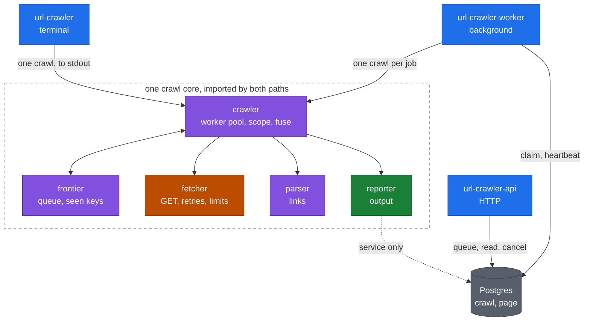

# url-crawler

Crawl every page behind one URL and print each page with the links found on it. The crawl stays on
one host: no other domains, no subdomains. Two entry points sit over one crawl core, and neither
imports the other.

- **[The CLI](#the-cli)** streams pages to stdout as each one completes. Read that section and you
  have the whole tool.
- **[The crawl service](#the-crawl-service)** runs the same crawl as a background job behind an HTTP
  API. Optional pip extra, separate docs, skippable for a CLI review.

## How the brief was read

Four readings were ambiguous, so the calls are stated up front.

- **Scope restricts what is followed, not what is printed.** An off-host or subdomain link prints
  under the page that contained it, and is never requested.
- **"URLs found on a page" means anchor hyperlinks**, `a[href]` and `area[href]`, not `img`,
  `script` or `link` subresources.
- **Only http(s) anchors are output.** Normalization drops `mailto:`, `tel:`, `javascript:` and
  `data:`, so they are neither printed nor followed.
- **Per-page output is deduplicated in document order.** A menu repeated in header and footer prints
  once; links are not sorted, because document order is already deterministic.
- **A redirect is a page, not a hop.** The client never follows one; a 301/302/303/307/308 reports
  as a page whose single link is its `Location`.

## Architecture

<details>
<summary>Diagram: one core, two entry points, Postgres only on the service side</summary>



Blue is an entry point, purple is crawl logic, orange talks to the network, green writes output,
grey stores. The CLI never touches Postgres, and the core never knows which entry point called it.
</details>

Module tables, the worker loop, the data model and the claim, heartbeat and reaper design:
[docs/architecture.md](docs/architecture.md).

## The CLI

**1. Install.** Needs Python 3.12+ and [uv](https://docs.astral.sh/uv/); `uv sync` installs from the
committed `uv.lock`, so the versions are the tested ones.

**2. Crawl one site.** Pages stream to stdout as they complete; Ctrl-C keeps what is done.

```bash
uv run url-crawler https://example.com
```

**3. Read the output.** Each page sits at column zero with its links indented under it, here against
the bundled fake site (`uv run python -m tests.fakesite.server --port 8765`):

```
$ uv run url-crawler http://127.0.0.1:8765/ --max-pages 4 --concurrency 2
http://127.0.0.1:8765/
  http://127.0.0.1:8765/a
  ...
  http://external.test/x
  http://sub.site.test/x

http://127.0.0.1:8765/b
  http://127.0.0.1:8765/a

... 2 more pages, then on stderr:
Crawled 4 pages (4 ok, 0 failed) and found 21 links in 0.4s (10.1 pages/s); 0 retries, 5 duplicate URLs skipped
```

Off-host links print but are never fetched. Logs and the summary go to stderr, so a pipe is clean.

**4. Turn the knobs.** `--format jsonl` emits one object per page plus a summary object. The
[flag table](docs/cli.md#flags) and the [exit codes](docs/cli.md#exit-codes) have the rest.

## The crawl service

Optional, and skippable for a CLI review. Six steps from nothing to results and back to nothing.
Full reference: [docs/service.md](docs/service.md).

**1. Start the stack.**

```bash
docker compose up --build -d
```

Builds the image, starts Postgres, runs `alembic upgrade head` to completion, then starts the API on
`:8000` and one worker polling for queued crawls. A build from scratch takes about fifteen seconds
once the base images are pulled, and later starts reuse the cache.

**2. Confirm it is up.**

```bash
$ curl -sS localhost:8000/healthz
{"status":"ok"}
```

The API answered and its `SELECT 1` reached Postgres. Swagger UI is at `/docs`, ReDoc at `/redoc`.

**3. Submit a crawl.**

```bash
$ curl -sS -D- -X POST localhost:8000/crawls -H 'content-type: application/json' \
    -d '{"seed": "https://example.com", "max_pages": 5}'
HTTP/1.1 202 Accepted
location: /crawls/fc7e9a7c-35fa-4f91-ad3e-47f16233c337

{"id":"fc7e9a7c-35fa-4f91-ad3e-47f16233c337","seed":"https://example.com/","state":"queued",
 "config":{"timeout":10.0,"max_bytes":5000000,"max_pages":5,"concurrency":10,"respect_robots":true},
 "created_at":"2026-09-09T16:22:29.688262Z","started_at":null,"finished_at":null,"attempts":0,
 "cancel_requested":false,"stats":null,"error":null}
```

202 means queued, not crawled. The id in the `Location` header is what every later call needs.

**4. Watch it.**

```bash
$ curl -sS localhost:8000/crawls/fc7e9a7c-35fa-4f91-ad3e-47f16233c337
{"id":"fc7e9a7c-35fa-4f91-ad3e-47f16233c337","seed":"https://example.com/","state":"finished",
 "started_at":"2026-09-09T16:22:30.591844Z","finished_at":"2026-09-09T16:22:30.998959Z",
 "attempts":1,"cancel_requested":false,"error":null,"config":{"…":"as posted"},
 "stats":{"retries":0,"pages_ok":1,"redirects":0,"links_found":1,"pages_total":1,
          "pages_failed":{},"elapsed_seconds":0.268,"duplicates_dropped":0,
          "pages_without_links":0}}
```

`state` plus `stats` say whether it finished. A five-page crawl takes under a second, so it is
usually already done; `GET /crawls/{id}/events` streams this same body every two seconds if not.

**5. Read the results.**

```bash
$ curl -sS localhost:8000/crawls/fc7e9a7c-35fa-4f91-ad3e-47f16233c337/pages
{"items":[{"seq":1,"url":"https://example.com/","status":200,"error":null,
           "links":["https://iana.org/domains/example"],
           "fetched_at":"2026-09-09T16:22:30.973348Z"}],"next_after":null}
```

One object per page, readable while the crawl is still going. `next_after` is the `after=` cursor
for the next batch, and null once you have read everything written so far.

**6. Stop it.**

```bash
docker compose down                          # stops the stack
docker compose up -d --scale worker=3        # or run more workers: nothing coordinates them
```

| Endpoint | Behaviour |
| --- | --- |
| `POST /crawls` | 202 with a `Location` header. The seed takes the CLI's normalization, so `example.com` is stored as `https://example.com/`. A private, unresolvable or non-http(s) seed is 422, and so is a bad field. |
| `GET /crawls` | 200, newest first. `state` filters; `limit` is 1 to 200, default 50. |
| `GET /crawls/{id}` | 200 with the stats that say whether a crawl finished; 404 for an unknown id. |
| `GET /crawls/{id}/pages` | 200 keyset page. `after` is the last `seq` you saw, `limit` is 1 to 500, default 100. |
| `GET /crawls/{id}/events` | 200 `text/event-stream`: a `stats` frame every two seconds, then one `end` frame at a terminal state. |
| `DELETE /crawls/{id}` | 202. A request, not a kill: `queued` aborts outright, `running` stops at its worker's next heartbeat with partial pages kept, terminal comes back unchanged. |
| `GET /healthz` | 200 after a `SELECT 1`; 503 when Postgres is unreachable. |

<details>
<summary>Worked examples: the endpoints the walkthrough skips, plus a refused seed</summary>

```bash
$ curl -sS 'localhost:8000/crawls?limit=2&state=finished'
{"items": [{"id": "fc7e9a7c-35fa-4f91-ad3e-47f16233c337", "seed": "https://example.com/",
            "state": "finished", "attempts": 1, "…": "the step 4 body, per match"}]}

$ curl -sSN localhost:8000/crawls/fc7e9a7c-35fa-4f91-ad3e-47f16233c337/events
event: stats
data: {"id":"fc7e9a7c-35fa-4f91-ad3e-47f16233c337","state":"finished","attempts":1, …}

event: end
data: {}

$ curl -sS -X DELETE localhost:8000/crawls/9c348a7f-5ad9-468e-af14-c71c75d21e2d
{"id": "9c348a7f-5ad9-468e-af14-c71c75d21e2d", "state": "aborted"}

$ curl -sS -X POST localhost:8000/crawls -H 'content-type: application/json' \
    -d '{"seed": "http://localhost:8000"}'
{"detail": {"seed": "localhost is a local hostname"}}
```

Real captured output, trimmed. The 422 is why these examples use `example.com`, not a local address.
</details>

## Noteworthy

- **Speed.** 20 workers crawl 301 pages in 1.93s, 156 pages/s, against a fake site with a 50ms
  per-request delay ([docs/performance.md](docs/performance.md)).
- **Robots on by default,** matched per RFC 9309 rather than by the standard library's prefix rules,
  and one that cannot be read blocks the crawl ([why](docs/design-decisions.md)).
- **Scope is exact `(host, port)` equality,** re-anchored after a seed redirect, so apex to www
  works and suffix tricks do not.
- **Hostile input is bounded.** Credentials are stripped before a URL is queued or printed, a URL
  carrying a control byte is refused, and bodies stream behind a content-type gate and a size cap
  that survives a gzip bomb.
- **The service guards its seed host, the CLI does not:** an API borrows its worker's network, a
  terminal borrows nothing ([docs/service.md](docs/service.md)).
- **Exit codes mean something.** 0 finished, 2 usage, 3 unusable seed, 4 failure fuse, 130
  interrupted with partial output flushed ([table](docs/cli.md#exit-codes)).
- **Two runtime dependencies and no crawling framework.** The CLI needs `httpx` and `selectolax`
  (the service extra adds `fastapi`, `sqlalchemy`, `asyncpg`, `alembic`, `uvicorn`); the frontier,
  scope check, retry policy, robots handling and link extraction are written here.
- **676 tests,** offline and deterministic, over a fake site packing every crawl hazard into 20
  pages. 82% coverage offline, 97% with Postgres ([docs/testing.md](docs/testing.md)).
- **Everything runs through `make`,** and CI runs the same targets: `check` (ruff, `mypy --strict`,
  tests), `test`, `db-up` for a local Postgres, `bench` for the sweep behind the speed number.

## Design decisions

<details>
<summary>Fifteen calls, each naming the option rejected and what would reverse it</summary>

| Decision | Why (one line) |
| --- | --- |
| [asyncio, one client, N workers](docs/design-decisions.md#asyncio-with-one-client-and-n-workers) | A crawl waits on sockets, so tasks beat threads and processes. |
| [The worker count is the only limit](docs/design-decisions.md#the-worker-count-is-the-only-limit) | No second semaphore, no rps cap, and an unbounded queue on purpose. |
| [Redirects are never followed by the client](docs/design-decisions.md#redirects-are-never-followed-by-the-client) | The client must never be the thing that picks the next host. |
| [Exact-host scope, re-anchored after a seed redirect](docs/design-decisions.md#exact-host-scope-re-anchored-after-a-seed-redirect) | Equality, not suffix matching, and apex to www still works. |
| [One normal form, and a stricter key for dedup](docs/design-decisions.md#one-normal-form-and-a-stricter-key-for-dedup) | The URL printed is the site's; the key that dedups it is not. |
| [Robots on by default, and unreadable means blocked](docs/design-decisions.md#robots-on-by-default-and-unreadable-means-blocked) | robots.txt is the access control, and a 5xx on it is not a yes. |
| [Retry classification by leaf type](docs/design-decisions.md#retry-classification-by-leaf-type) | Enumerate the retryable exceptions, never their base class. |
| [No circuit breaker, but a failure fuse](docs/design-decisions.md#no-circuit-breaker-but-a-failure-fuse) | One bounded batch against one host has nothing to half-open. |
| [A page with no links is a leaf](docs/design-decisions.md#a-page-with-no-links-is-a-leaf) | And 90% of them is the answer to the JavaScript sites this tool cannot render. |
| [Postgres in the service, and no Celery or Redis](docs/design-decisions.md#postgres-in-the-service-and-no-celery-or-redis) | The job store is a table, not a broker, and the CLI needs no store at all. |
| [An HTTP API, no UI](docs/design-decisions.md#an-http-api-no-ui) | Keyset pagination is the interesting part, and a UI would only wrap it. |
| [The service guards its seed host, the CLI does not](docs/design-decisions.md#the-service-guards-its-seed-host-the-cli-does-not) | An API borrows its worker's network; a terminal borrows nothing. |
| [Standard library logging and a stats dataclass](docs/design-decisions.md#standard-library-logging-and-a-stats-dataclass) | stdout stays clean, and the counters outlive a cancelled task. |
| [One generic parser, no Strategy or Factory](docs/design-decisions.md#one-generic-parser-no-strategy-or-factory) | The seed is arbitrary, so there is no dispatch key at design time. |
| [Playwright and Scrapy](docs/design-decisions.md#playwright-and-scrapy) | Both banned by the exercise, and named because a reviewer will wonder. |
</details>

## Tooling and AI disclosure

- **Editor:** Visual Studio Code and nothing more. No Copilot, no inline completion.
- **AI:** Claude Code in a multi-agent workflow I directed. Architect agents proposed candidate
  architectures, critics attacked them, and writer agents implemented one module each against an
  interface contract I approved before any code was written.
- **Nothing rests on a model having said it:** behaviour is pinned by the test suite, types by
  `mypy --strict`, style by `ruff`, versions by the committed `uv.lock`, and the speed table by a
  benchmark measured on the machine it names.
- **Full account,** including two mistakes the review loop caught:
  [docs/ai-disclosure.md](docs/ai-disclosure.md).

## Documentation

| Page | What is in it |
| --- | --- |
| [docs/architecture.md](docs/architecture.md) | Features, core modules, the worker loop, the service, the data model, claim and lease |
| [docs/design-decisions.md](docs/design-decisions.md) | Every decision in full, with the rejected option and the reversal trigger |
| [docs/cli.md](docs/cli.md) | Flags, exit codes, text and JSONL output, the banner, Docker and pip |
| [docs/service.md](docs/service.md) | Crawl service: running it, the API, configuration, what it does not do yet |
| [docs/performance.md](docs/performance.md) | Patterns used for speed, the benchmark and its method, the caveats |
| [docs/testing.md](docs/testing.md) | Test layers, how to run each, the fake site, CI, lint and types |
| [docs/extending.md](docs/extending.md) | Multi-domain crawling, why a CLI stops fitting, ranked future work |
| [docs/ai-disclosure.md](docs/ai-disclosure.md) | Tooling, sources consulted, what AI drafted, how it was verified |

## License

MIT. See [LICENSE](LICENSE).
