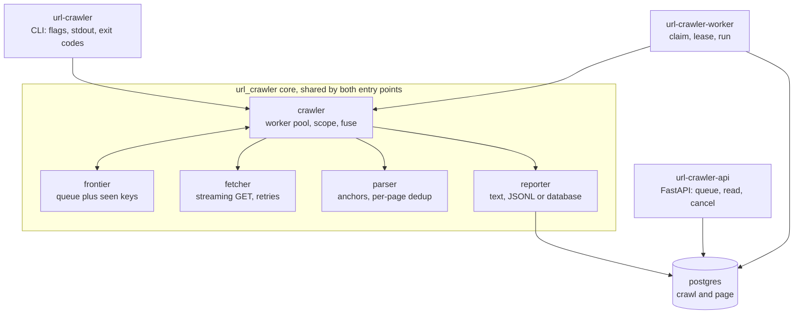

# url-crawler

A Python CLI that takes one URL, crawls the whole site behind it, and prints every page it visits
together with every link found on that page. It stays on a single host: no other domains, no
subdomains. There are two entry points over the same crawl core: the `url-crawler` command, which
streams results to stdout as each page completes so a large crawl is useful before it finishes, and
an optional [crawl service](docs/service.md) that runs the same crawl as a background job behind an
HTTP API.

Three readings of the brief were ambiguous, so the choices are stated up front:

- **Scope restricts what is followed, not what is printed.** A link to another domain or to a
  subdomain appears in the output of the page that contained it, and is never requested.
- **"URLs found on a page" means anchor hyperlinks**, `a[href]` and `area[href]`, not subresources
  such as `img`, `script` or `link`. Anchors are the navigable graph the crawl walks.
- **Per-page output is deduplicated in first-occurrence document order.** A navigation menu repeated
  in a header and a footer prints once. Links are not sorted, because document order is already
  deterministic.

Redirects follow from the same model: the HTTP client never follows one, and a 301/302/303/307/308
response is reported as a page whose single link is its `Location`. The
[design decisions](docs/design-decisions.md) cover what that model buys.

## Architecture



[docs/architecture.md](docs/architecture.md) has the module tables, the worker loop, the data model
and the claim, heartbeat and reaper design.

## Getting started

Requires Python 3.12+ and [uv](https://docs.astral.sh/uv/). Full reference in
[docs/cli.md](docs/cli.md).

```bash
uv sync                                             # install, from the committed uv.lock
uv run url-crawler https://example.com              # crawl and print to stdout
uv run url-crawler example.com --format jsonl > out.jsonl   # scheme defaults to https
```

The same CLI in Docker:

```bash
docker build --target cli -t url-crawler .
docker run --rm url-crawler https://example.com
```

The crawl service, with Postgres, migrations, the API on `:8000` and one worker:

```bash
docker compose up --build

curl -sS -X POST localhost:8000/crawls \
  -H 'content-type: application/json' \
  -d '{"seed": "https://example.com"}'
# {"id":"7c1f...","seed":"https://example.com/","state":"queued", ...}

curl -sS localhost:8000/crawls/7c1f.../pages | jq '.items[] | {url, status, links}'
```

Everything else runs through `make`, and CI runs the same targets:

```bash
make check     # ruff check, ruff format --check, mypy --strict, then the test suite
make test      # 485 tests, offline and deterministic
make db-up     # local Postgres for the service and its tests
make bench     # the concurrency sweep behind the numbers below
```

## Noteworthy

- **Speed.** 20 workers crawl 301 pages in 1.93s, 156 pages/s, against a fake site with a 50ms
  per-request delay. The patterns behind that number, the method and the caveats are in
  [docs/performance.md](docs/performance.md).
- **Safety.** robots.txt is on by default, scope is exact `(host, port)` equality rather than a
  suffix match, and bodies stream behind a content-type gate and a size cap so a 4 GB video is never
  downloaded.
- **Exit codes that mean something.** 0 finished, 2 usage error, 3 unusable seed, 4 failure fuse
  tripped, 130 interrupted with partial output flushed. Full table in
  [docs/cli.md](docs/cli.md#exit-codes).
- **Two runtime dependencies.** The CLI needs `httpx` and `selectolax` and nothing else. The service
  adds `fastapi`, `sqlalchemy`, `asyncpg`, `alembic` and `uvicorn` behind an optional `service`
  dependency group, so `pip install .` still installs exactly those two. The frontier, the scope
  check, the retry policy, the robots.txt handling and the link extraction are written in this
  repository rather than pulled from a crawling framework, which is what makes each of them testable
  and explainable in the docs below.
- **485 tests**, deterministic and offline by default, over a fake site that packs every crawl
  hazard into 20 pages. See [docs/testing.md](docs/testing.md).

## Design decisions

Each one names the option that was rejected and what would reverse it.

| Decision | Why (one line) |
| --- | --- |
| [asyncio, one client, N workers](docs/design-decisions.md#asyncio-with-one-client-and-n-workers) | A crawl waits on sockets, so tasks beat threads and processes. |
| [The worker count is the only limit](docs/design-decisions.md#the-worker-count-is-the-only-limit) | No second semaphore, no rps cap, and an unbounded queue on purpose. |
| [Redirects are never followed by the client](docs/design-decisions.md#redirects-are-never-followed-by-the-client) | The client must never be the thing that picks the next host. |
| [Exact-host scope, re-anchored after a seed redirect](docs/design-decisions.md#exact-host-scope-re-anchored-after-a-seed-redirect) | Equality, not suffix matching, and apex to www still works. |
| [Robots on by default, nofollow followed](docs/design-decisions.md#robots-on-by-default-nofollow-followed) | robots.txt is the access control, nofollow is not. |
| [Retry classification by leaf type](docs/design-decisions.md#retry-classification-by-leaf-type) | Enumerate the retryable exceptions, never their base class. |
| [No circuit breaker, but a failure fuse](docs/design-decisions.md#no-circuit-breaker-but-a-failure-fuse) | One bounded batch against one host has nothing to half-open. |
| [A page with no links is a leaf](docs/design-decisions.md#a-page-with-no-links-is-a-leaf) | And 90% of them is the answer to the JavaScript sites this tool cannot render. |
| [Postgres in the service, and no Celery or Redis](docs/design-decisions.md#postgres-in-the-service-and-no-celery-or-redis) | The job store is a table, not a broker, and the CLI needs no store at all. |
| [An HTTP API, no UI](docs/design-decisions.md#an-http-api-no-ui) | Keyset pagination is the interesting part, and a UI would only wrap it. |
| [Standard library logging and a stats dataclass](docs/design-decisions.md#standard-library-logging-and-a-stats-dataclass) | stdout stays clean, and the counters outlive a cancelled task. |
| [One generic parser, no Strategy or Factory](docs/design-decisions.md#one-generic-parser-no-strategy-or-factory) | The seed is arbitrary, so there is no dispatch key at design time. |
| [Playwright and Scrapy](docs/design-decisions.md#playwright-and-scrapy) | Both banned by the exercise, and named because a reviewer will wonder. |

## Tooling and AI disclosure

Visual Studio Code was the editor and nothing more: no Copilot, no inline completion. Every AI
interaction ran through Claude Code in a multi-agent workflow I directed, where architect agents
proposed candidate architectures, critics attacked them, and writer agents implemented one module
each against an interface contract I approved before any code was written. Nothing here rests on a
model having said it: behaviour is pinned by the test suite, types by `mypy --strict`, style by
`ruff`, dependency versions by the committed `uv.lock`, and the speed table by a benchmark measured
on the machine it names. [docs/ai-disclosure.md](docs/ai-disclosure.md) has the full account,
including two mistakes the review loop caught.

## Documentation

| Page | What is in it |
| --- | --- |
| [docs/architecture.md](docs/architecture.md) | Features, core modules, the worker loop, the service, the data model, claim and lease |
| [docs/design-decisions.md](docs/design-decisions.md) | Every decision in full, with the rejected option and the reversal trigger |
| [docs/cli.md](docs/cli.md) | Flags, exit codes, text and JSONL output, the banner and the progress line |
| [docs/service.md](docs/service.md) | Crawl service: running it, the API, configuration, what it does not do yet |
| [docs/performance.md](docs/performance.md) | Patterns used for speed, the benchmark and its method, the caveats |
| [docs/testing.md](docs/testing.md) | Test layers, how to run each, the fake site, CI, lint and types |
| [docs/extending.md](docs/extending.md) | Multi-domain crawling, why a CLI stops fitting, ranked future work |
| [docs/ai-disclosure.md](docs/ai-disclosure.md) | Tooling, sources consulted, what AI drafted, how it was verified |

## License

MIT. See [LICENSE](LICENSE).
