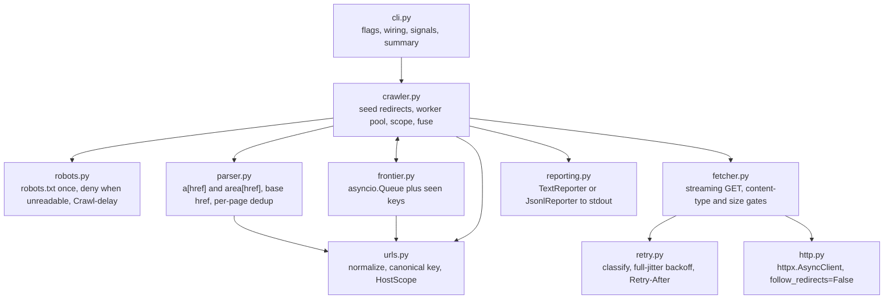
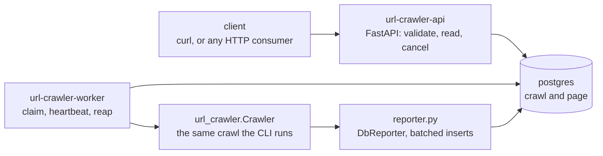

# Architecture

How the crawler is put together: the core modules, the worker loop, and the pieces the crawl service
adds around them.

## The core

One process, one event loop, one HTTP client. `cli.py` parses flags and wires the objects together,
`crawler.py` owns the crawl, and everything else is a small single-purpose module. Retry lives
inside the fetcher, so the crawler only ever sees a finished `FetchResult` or `FetchError`.



## The worker loop

A worker takes a URL from the frontier (the frontier is the set of URLs found but not yet crawled),
fetches it, parses the body, reports the page, then enqueues the links that pass scope and robots
before calling `task_done()`. The crawl ends when the queue is empty and every claimed URL is done
(`Queue.join()`), so no sentinel values and no timeouts are involved. A catch-all around the per-URL
pipeline turns an unexpected exception into one failed page instead of a cancelled `TaskGroup`.

## Core modules

| Module | Responsibility |
| --- | --- |
| `cli.py` | argparse flags, object wiring, SIGINT and SIGTERM, exit codes, banner and progress line, stderr summary |
| `progress.py` | start banner and the redrawing progress line, both stderr and TTY-only |
| `config.py` | frozen `CrawlConfig`, validated once in `__post_init__` |
| `crawler.py` | seed redirect chain, the optional seed guard, scope re-anchoring, worker pool, per-page pipeline, max-pages drain, failure fuse |
| `frontier.py` | `asyncio.Queue` plus a set of canonical keys: dedup, backlog size, termination |
| `fetcher.py` | one streaming GET per attempt, the whole-request budget, content-type and size gates, retry loop |
| `retry.py` | pure classification, full-jitter backoff, `Retry-After` parsing |
| `parser.py` | link extraction with selectolax, `<base href>`, per-page dedup in document order |
| `urls.py` | `prepare_seed`; `normalize`, which drops userinfo and resolves dot segments; `canonical_key`, which folds percent-encoding and sorts query names; `resolve_href`; `HostScope` |
| `robots.py` | fetch robots.txt once through up to five redirects, parse it, `Crawl-delay`, deny everything when it cannot be read |
| `http.py` | the one `httpx.AsyncClient` factory, shared by the CLI and the service worker |
| `reporting.py` | `Reporter` protocol with a text and a JSONL implementation |
| `models.py` | `FetchResult`, `FetchError`, `FetchErrorKind`, `PageResult`, `CrawlStats`, and the `summary` both the JSONL output and the service store |

`src/url_crawler_service/` holds the optional service and imports the core; the core never imports
it.

The version has one source: `__version__` in `src/url_crawler/__init__.py`, which
`[tool.hatch.version]` reads when it builds the wheel. The banner, `--version` and the default user
agent all read the same string, so nothing can drift from the published version.

## The crawl service

The API validates a request, writes a row and reads rows back. The worker claims a queued crawl,
runs it, and heartbeats its lease while it does. A lease is a claim with an expiry: the worker keeps
it alive by writing a timestamp, and loses it if it goes quiet. Nothing coordinates the workers, so
N workers are N processes.



### The seed host guard

The service refuses a seed that points inside its own network. `POST /crawls` resolves the host and
answers 422 before it writes a row, and the worker repeats the check before the first seed fetch and
before every hop of the seed's redirect chain. A rejected seed ends the crawl `failed` with
`seed rejected: <reason>`. [service.md](service.md) lists what counts as private, and
[design-decisions.md](design-decisions.md#the-service-guards-its-seed-host-the-cli-does-not) says
why the CLI has no such guard.

### Service modules

| Module | Responsibility |
| --- | --- |
| `settings.py` | `Settings.from_env()`, validation, `SettingsError` naming the bad variable |
| `db.py` | declarative `Base`, async engine, session factory |
| `orm.py` | the `crawl` and `page` tables and `CrawlState` |
| `alembic/` | the migration environment and the versions `alembic upgrade head` applies |
| `models.py` | `PageRow` and the `PageResult` to row conversion |
| `repository.py` | every query, each in its own short transaction: claim, heartbeat, finish, release, reap, cancel, lease-fenced inserts and page reads |
| `reporter.py` | `DbReporter`, the batching `Reporter` the worker hands to the core crawler, retrying whatever an insert rejected |
| `worker.py` | claim loop, heartbeat, cancellation, graceful shutdown, terminal state |
| `api.py` | the FastAPI app, its routes and the lifespan that disposes the engine |
| `schemas.py` | request and response models, and the shared seed validation |
| `hostcheck.py` | `private_host_reason`: resolve a seed host and say why it must not be crawled |

## Data model

Two tables, both created by the Alembic migration in `src/url_crawler_service/alembic/versions/`.

| Table | Columns |
| --- | --- |
| `crawl` | `id` uuid PK, `seed`, `config` jsonb, `state`, `created_at`, `started_at`, `finished_at`, `heartbeat_at`, `worker_id`, `attempts`, `cancel_requested`, `stats` jsonb, `error`. Index on `(state, created_at)`. |
| `page` | PK `(crawl_id, seq)` with `crawl_id` cascading from `crawl`, plus `url`, `status`, `error_kind`, `error_message`, `links` jsonb, `fetched_at`. |

`state` is one of `queued`, `running`, `finished`, `failed`, `aborted`. `seq` is assigned by the
worker, one-based and gap-free, which is what makes it a cursor. One page is one row, so the links
of a page are stored as a JSON array rather than a join table: nothing queries across links, and a
consumer always asks for whole pages.

### Alembic layout

`alembic.ini` at the repository root points `script_location` at
`src/url_crawler_service/alembic`, leaves `sqlalchemy.url` empty, and runs `ruff check --fix` and
`ruff format` on every generated revision as post-write hooks. `env.py` reads `DATABASE_URL` from
the environment instead of the ini file.

Migrations are generated, never written by hand: `make migration m="what changed"` runs
`alembic revision --autogenerate`. A service test runs `alembic check` and fails when the committed
migration and the ORM models have drifted apart, and another downgrades to base and upgrades again.

## Claim, heartbeat, reaper

A worker claims the oldest queued crawl in one transaction:

```sql
SELECT crawl.id, crawl.attempts FROM crawl
WHERE crawl.state = 'queued' ORDER BY crawl.created_at
LIMIT 1 FOR UPDATE SKIP LOCKED;

UPDATE crawl SET state = 'running', started_at = now(), heartbeat_at = now(),
                 worker_id = $1, attempts = attempts + 1
WHERE id = $2 RETURNING ...;
```

`SKIP LOCKED` tells Postgres to pass over rows another transaction has locked instead of waiting for
them, and it is why no broker is needed. Two workers running that statement at the same instant take
different rows instead of blocking on each other, which a test asserts with two concurrent claims. A
claim whose `attempts` is already above zero deletes that crawl's earlier pages first, so a retried
crawl never returns a mix of two attempts.

While the crawl runs, the worker heartbeats every `HEARTBEAT_SECONDS`: one `UPDATE` that refreshes
`heartbeat_at`, stores the current stats snapshot, and returns `cancel_requested`. The `UPDATE`
matches on `worker_id` too, so a worker that lost its lease gets no row back, learns it no longer
owns the crawl, and stops writing.

`finish` and `release` answer the same question: each returns whether its `UPDATE` matched a row. A
worker that matched nothing logs a warning naming the state it wanted to record, rather than
reporting a state it never wrote.

The worker also reaps: any crawl still `running` whose `heartbeat_at` is older than `LEASE_SECONDS`
is settled in one pass. A cancelled one becomes `aborted`, one below `MAX_ATTEMPTS` goes back to
`queued`, and the rest become `failed` with `error = "worker lost"`. A `kill -9` therefore costs one
lease period, not a stuck job. Reaping runs once when the worker starts and then at most once per
`LEASE_SECONDS`, because every worker issues the same three updates and running them on each
one-second poll would repeat that work for nothing.

On `SIGTERM` the worker does better than that: it cancels the crawl, writes the pages it has, and
releases the row back to `queued` at once, so no lease period is lost. The attempt counter is left
as it is, and only the reaper consults `MAX_ATTEMPTS`, so a rolling deploy re-runs the crawl instead
of failing it. A cancel request that raced the shutdown wins: the release matches only a row with
`cancel_requested = false`, and when it matches nothing the worker records `aborted` instead.

## Surviving a database outage

The claim loop catches every exception, not only SQLAlchemy's. A Postgres that is down surfaces as
`ConnectionRefusedError` or a DNS failure well before it is a `DBAPIError`, and either one used to
end the worker process. It now logs the traceback, waits `WORKER_POLL_SECONDS` and polls again, so a
database restart costs a poll interval. The compose file restarts the api and worker containers
`unless-stopped`, for the crashes this does not cover.

Pages are written by `DbReporter`, which buffers whatever the crawler reports and inserts it in one
`executemany` when the buffer reaches `PAGE_BATCH_SIZE` or `PAGE_FLUSH_SECONDS` elapses. Its
`page()` method never awaits, so a slow database slows the flusher and not the crawl loop. A failed
insert keeps its rows in the buffer and the flusher retries them on the next tick. The flush after
the crawl ends is the last attempt: if it fails, the crawl is recorded `failed` with that error, and
a crawl that was cancelled keeps its own reason with the write error appended to it.

Every insert is fenced by the lease. It locks the crawl row `FOR SHARE` and writes only while that
row is still `running` under this worker id, in the same transaction. A worker whose lease was
reaped raises `LeaseLostError` instead of mixing its pages into the attempt another worker now
owns; it logs a warning, records no terminal state, and leaves the row to its new owner.

## Cancel semantics

`DELETE /crawls/{id}` is a request, not a kill. It answers 202 with the resulting state for any
known crawl, and 404 otherwise.

- A `queued` crawl becomes `aborted` immediately, with `error = "cancelled before start"`, and no
  worker ever claims it.
- A `running` crawl gets `cancel_requested = true`. Its worker sees the flag on the next heartbeat,
  cancels the crawl task, flushes the pages already crawled, and records `aborted` with
  `error = "cancelled by request"`. Partial results stay readable.
- A finished, failed or already aborted crawl is left exactly as it is.

---

[Back to README](../README.md)
