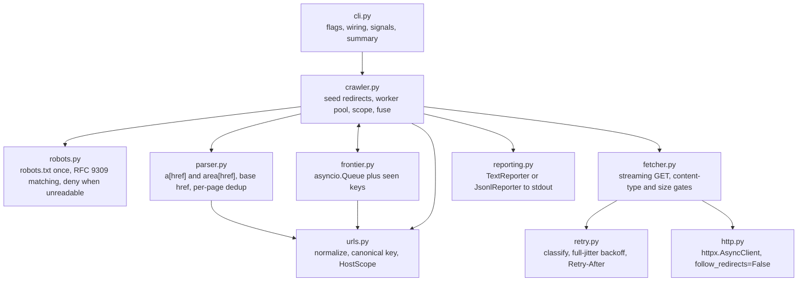
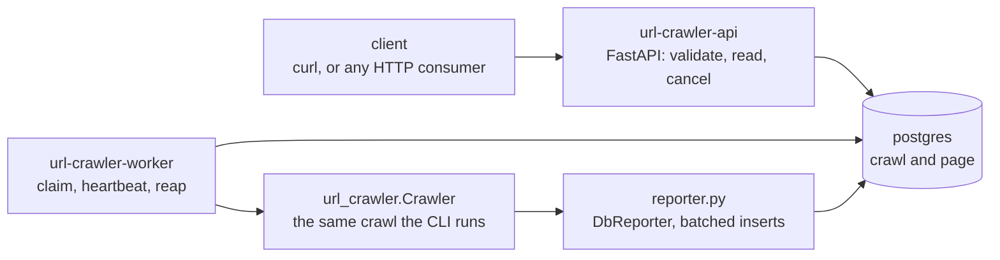

# Architecture

How the crawler is put together: the core modules, the worker loop, and the pieces the crawl
service adds around them.

## The core

One process, one event loop, one HTTP client. `cli.py` wires the objects together and `crawler.py`
owns the crawl; everything else is a small single-purpose module.



## Core modules

| Module | Responsibility |
| --- | --- |
| `cli.py` | argparse flags, object wiring, SIGINT and SIGTERM, exit codes, banner, stderr summary |
| `progress.py` | start banner and the redrawing progress line, both stderr and TTY-only |
| `config.py` | frozen `CrawlConfig`, validated once in `__post_init__` |
| `crawler.py` | seed redirect chain, optional seed guard, scope re-anchoring, worker pool, per-page pipeline, max-pages drain, failure fuse |
| `frontier.py` | `asyncio.Queue` plus a set of canonical keys: dedup, backlog size, termination |
| `fetcher.py` | one streaming GET per attempt, whole-request budget, content-type and size gates, bounded incremental decompression, retry loop |
| `retry.py` | pure classification, full-jitter backoff, `Retry-After` parsing |
| `parser.py` | link extraction with selectolax, `<base href>`, per-page dedup in document order |
| `urls.py` | `prepare_seed`, `normalize` (drops userinfo, resolves dot segments, rejects control bytes), `canonical_key`, `resolve_href`, `HostScope` |
| `robots.py` | fetch robots.txt once through up to five redirects behind an optional guard, RFC 9309 group selection and matching, `Crawl-delay`, deny everything when unreadable |
| `http.py` | the one `httpx.AsyncClient` factory, shared by the CLI and the service worker |
| `reporting.py` | `Reporter` protocol with a text and a JSONL implementation |
| `models.py` | `FetchResult`, `FetchError`, `FetchErrorKind`, `PageResult`, `CrawlStats`, `summary` |

`src/url_crawler_service/` imports the core; the core never imports it. `__version__` in
`src/url_crawler/__init__.py` is the one source the banner, `--version` and the user agent share.

## The worker loop

1. Take a URL from the frontier (found but not yet crawled).
2. Fetch it.
3. Parse the body for links.
4. Report the page.
5. Enqueue the links that pass scope and robots.
6. Call `task_done()`, repeating until `Queue.join()` returns: no sentinel values, no timeouts.
7. An exception anywhere in the pipeline fails that one page, not the whole `TaskGroup`.

## The crawl service

The API validates a request, writes a row and reads rows back. The worker claims a queued crawl,
runs it, and heartbeats its lease. Nothing coordinates the workers, so N workers are N processes.



### The seed host guard

`POST /crawls` refuses a seed pointing inside the service's own network, and the worker repeats the
check on every redirect hop and on robots.txt. [service.md](service.md#the-seed-host-guard) lists
what counts as private; [design-decisions.md](design-decisions.md#the-service-guards-its-seed-host-the-cli-does-not)
says why the CLI has no such guard.

### Service modules

| Module | Responsibility |
| --- | --- |
| `settings.py` | `Settings.from_env()`, validation, `SettingsError` naming the bad variable |
| `db.py` | declarative `Base`, async engine (driver connect and command timeouts), session factory |
| `orm.py` | the `crawl` and `page` tables and `CrawlState` |
| `alembic/` | the migration environment and the versions `alembic upgrade head` applies |
| `models.py` | `PageRow` and the `PageResult` to row conversion |
| `repository.py` | every query, each in its own short transaction: claim, heartbeat, finish, release, reap, cancel, lease-fenced inserts and page reads |
| `reporter.py` | `DbReporter`, the batching `Reporter` the worker hands to the core crawler |
| `worker.py` | claim loop, heartbeat, cancellation, graceful shutdown, terminal state |
| `api.py` | the FastAPI app, its routes and the lifespan that disposes the engine |
| `schemas.py` | request and response models, and the shared seed validation |
| `hostcheck.py` | `private_host_reason`: resolve a seed host and say why it must not be crawled |

## Data model

| Table | Columns |
| --- | --- |
| `crawl` | `id` uuid PK, `seed`, `config` jsonb, `state`, `created_at`, `started_at`, `finished_at`, `heartbeat_at`, `worker_id`, `attempts`, `cancel_requested`, `stats` jsonb, `error`. Index on `(state, created_at)`. |
| `page` | PK `(crawl_id, seq)` with `crawl_id` cascading from `crawl`, plus `url`, `status`, `error_kind`, `error_message`, `links` jsonb, `fetched_at`. |

`state` is one of `queued`, `running`, `finished`, `failed`, `aborted`. `seq` is one-based and
gap-free. A page's links are a JSON array, not a join table, so a consumer always reads whole pages.
Migrations are generated only, via `make migration m="..."`; a test checks for ORM drift and
round-trips a downgrade and upgrade.

## Claim, heartbeat, reaper

A worker claims the oldest queued crawl in one transaction, deleting that crawl's existing pages
unconditionally so `seq` restarts at 1. `SKIP LOCKED` is why no broker is needed:

```sql
SELECT crawl.id, crawl.attempts FROM crawl
WHERE crawl.state = 'queued' ORDER BY crawl.created_at
LIMIT 1 FOR UPDATE SKIP LOCKED;

UPDATE crawl SET state = 'running', started_at = now(), heartbeat_at = now(),
                 worker_id = $1, attempts = attempts + 1
WHERE id = $2 RETURNING ...;
```

- The heartbeat gives up on real elapsed time, backed by driver connect and command timeouts.
- `finish` and `release` report whether their `UPDATE` matched a row; a graceful `release` also
  returns the attempt it took, since a clean handoff is not a failed try.
- The reaper settles a `running` crawl with a stale heartbeat: cancelled becomes `aborted`, below
  `MAX_ATTEMPTS` requeues, the rest become `failed`.
- Page inserts are idempotent on `(crawl_id, seq)` and fenced by the lease, so a re-sent batch is a
  no-op. [service.md](service.md#crawls-run-at-least-once) states what this design costs.

## Cancel semantics

`DELETE /crawls/{id}` is a request, not a kill: 202 with the resulting state, 404 when unknown.

| Crawl state | Result |
| --- | --- |
| `queued` | Becomes `aborted` at once, `error = "cancelled before start"`. No worker ever claims it. |
| `running` | `cancel_requested = true`. The worker sees it on the next heartbeat, cancels the task, flushes crawled pages, records `aborted`. |
| finished, failed, aborted | Left exactly as it is. |

---

[Back to README](../README.md)
