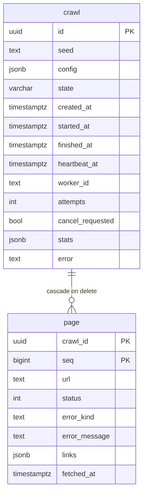

# Data model

Every column in the crawl service's two tables, what it holds, and who writes it. The CLI has no
database, so nothing here applies to it. Schema shown is the live one, read from
`psql \d crawl` and `\d page`.

Two tables and nothing else. A crawl is one job; a page is one URL that job fetched.



## `crawl`, one row per job

| Column | Type | Null | Who writes it | What it holds |
| --- | --- | --- | --- | --- |
| `id` | `uuid` | no | API, on `POST /crawls` | Primary key, generated client side. The id in the `Location` header. |
| `seed` | `text` | no | API | The start URL after normalization, so `example.com` is stored as `https://example.com/`. |
| `config` | `jsonb` | no | API | The crawl settings as posted: `timeout`, `max_bytes`, `max_pages`, `concurrency`, `respect_robots`. Rebuilt into a `CrawlConfig` when a worker claims the row. |
| `state` | `varchar(16)` | no | API, then the worker | `queued`, `running`, `finished`, `failed` or `aborted`. See the lifecycle below. |
| `created_at` | `timestamptz` | no | Postgres `now()` | When the job was accepted. Orders the claim queue, oldest first. |
| `started_at` | `timestamptz` | yes | Worker, on claim | When a worker took the job. Reset on every claim, so a requeued crawl shows its latest start. |
| `finished_at` | `timestamptz` | yes | Worker, or the reaper | When the row reached a terminal state. Null while queued or running. |
| `heartbeat_at` | `timestamptz` | yes | Worker, every 5 seconds | Proof of life. The reaper treats a row older than `LEASE_SECONDS` as abandoned. |
| `worker_id` | `text` | yes | Worker, on claim | `hostname:pid`. Every write the worker makes is fenced on this value, so a worker that lost its lease cannot write. |
| `attempts` | `integer` | no | Worker | How many times the job has been claimed. The reaper gives up at `MAX_ATTEMPTS`. A graceful shutdown gives the attempt back, so a rolling deploy does not burn one. |
| `cancel_requested` | `boolean` | no | API, on `DELETE` | A request, not a kill. The running worker sees it at its next heartbeat and stops. |
| `stats` | `jsonb` | yes | Worker, with each heartbeat and at the end | The run summary, same shape the CLI prints in JSONL mode. Null until the first heartbeat. |
| `error` | `text` | yes | Worker, or the reaper | Why a crawl failed or aborted. Null on success. |

Indexes: primary key on `id`, plus `ix_crawl_state_created` on `(state, created_at)`, which is the
index the claim query uses to find the oldest queued row.

<details>
<summary>The <code>stats</code> shape, and what each counter means</summary>

```json
{"pages_ok": 4, "pages_failed": {"http_status": 1}, "pages_without_links": 0, "redirects": 0,
 "links_found": 21, "duplicates_dropped": 5, "retries": 0, "pages_total": 5,
 "elapsed_seconds": 0.268}
```

| Key | Meaning |
| --- | --- |
| `pages_ok` | Pages fetched and reported without an error, redirects included. |
| `pages_failed` | Counts per error kind, the same kinds as `page.error_kind`. |
| `pages_without_links` | Successful HTML pages that contained no anchors. A leaf, not a failure. |
| `redirects` | Pages that were a 3xx reported with their `Location` as the only link. |
| `links_found` | Links extracted from HTML bodies. A redirect's target is printed but not counted here. |
| `duplicates_dropped` | Links already seen, so never queued a second time. |
| `retries` | Extra attempts beyond the first, summed over every page. |
| `pages_total` | `pages_ok` plus every failure. What `--max-pages` caps. |
| `elapsed_seconds` | Wall time, rounded to milliseconds. |

</details>

## `page`, one row per URL fetched

| Column | Type | Null | What it holds |
| --- | --- | --- | --- |
| `crawl_id` | `uuid` | no | Half the primary key, foreign key to `crawl.id` with `ON DELETE CASCADE`. Deleting a crawl deletes its pages. |
| `seq` | `bigint` | no | The other half. One-based and gap-free within a crawl, assigned in completion order. The keyset cursor `GET /crawls/{id}/pages?after=` walks. |
| `url` | `text` | no | The page fetched, in normalized form. Not the same as `crawl.seed` except for the first row. |
| `status` | `integer` | yes | HTTP status. Null when nothing was received, for example a timeout or a connection error. |
| `error_kind` | `text` | yes | Null on success. Otherwise one of `timeout`, `connection`, `http_status`, `unsupported_content`, `too_large`, `invalid_url`, `protocol`, `internal`. |
| `error_message` | `text` | yes | The detail behind the kind, for example `HTTP 404` or the mime type that was refused. |
| `links` | `jsonb` | no | A JSON array of the URLs found on the page, deduplicated in document order. Empty for a leaf or a failure. |
| `fetched_at` | `timestamptz` | no | When the fetch completed. |

Links live in the row as an array rather than in a join table, so one page is one row and one API
response item. A consumer never sees half a page, and there is no second query per page.

## Lifecycle

```
queued ──claim──> running ──> finished     crawl completed
                     │
                     ├───────> failed      seed unusable, or too many attempts
                     ├───────> aborted     cancelled, or the failure fuse tripped
                     └──reap──> queued     worker went silent, attempts under the limit
```

- A crawl is only ever `running` for one worker at a time, enforced by `SELECT ... FOR UPDATE SKIP
  LOCKED` on the claim.
- Every claim deletes the crawl's existing pages first, unconditionally, so `seq` restarts at 1 and
  a rerun never interleaves with an earlier attempt.
- Page writes are idempotent on `(crawl_id, seq)` and fenced on `worker_id`, so a re-sent batch is a
  no-op and a worker that lost its lease writes nothing.
- Crawls are at-least-once. See [crawls run at least once](service.md#crawls-run-at-least-once).

## Reading it directly

```bash
docker compose exec postgres psql -U crawler -d crawler

\d crawl
select id, seed, state, attempts, stats->>'pages_total' as pages from crawl order by created_at desc limit 5;
select seq, url, status, error_kind, jsonb_array_length(links) as links from page where crawl_id = '<id>' order by seq;
```

## Changing it

Migrations are generated, never hand written.

```bash
make migration m="add the thing"   # alembic revision --autogenerate
make migrate                       # alembic upgrade head
```

A test in `tests/service/test_migrations.py` fails on drift between the ORM and the migrations, and
round-trips a downgrade and upgrade.

Back to the [README](../README.md), or the rest of
[the architecture](architecture.md).
